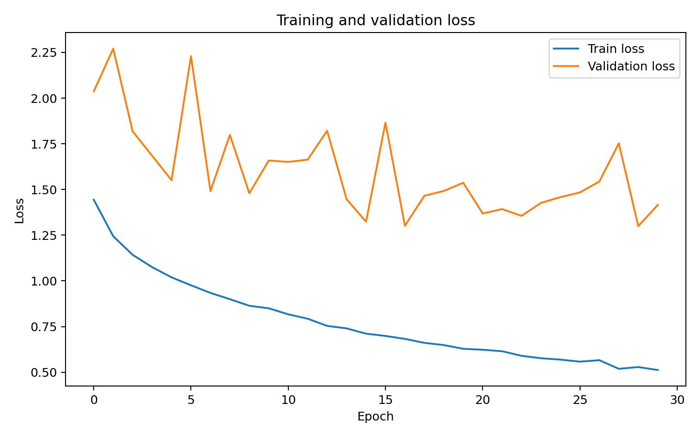
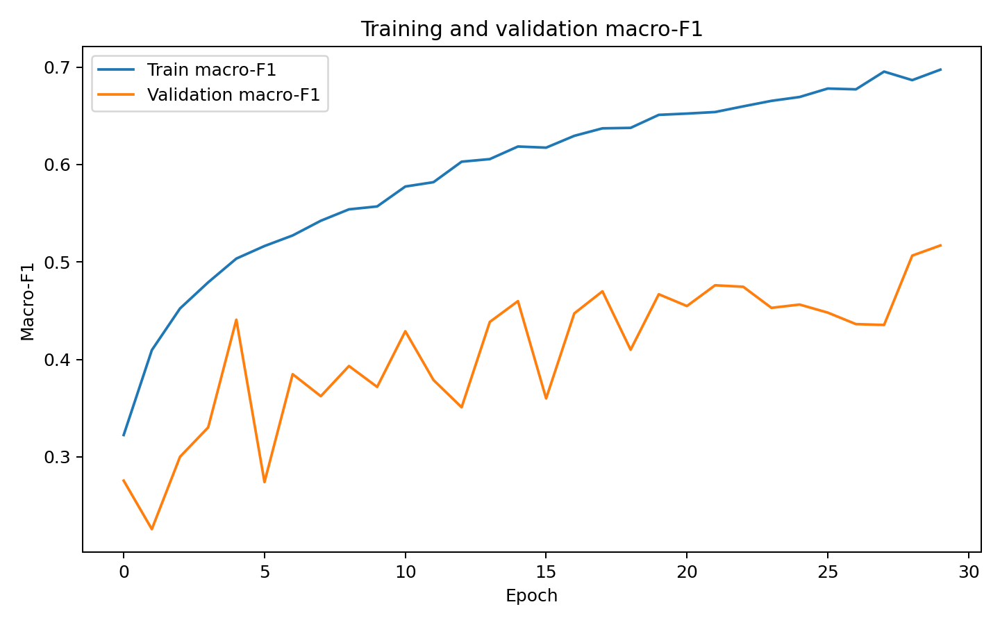

# HAM10000 Skin Lesion Classification — CNN from Scratch

## Overview

This repository contains a convolutional neural network implemented from scratch using NumPy, with optional CuPy/CUDA acceleration, for multiclass skin lesion classification on the HAM10000 dataset.

The core neural-network operations are implemented manually rather than through a deep-learning framework such as PyTorch or TensorFlow.

## Classes

The model handles the 7 HAM10000 diagnostic classes:

- `akiec`
- `bcc`
- `bkl`
- `df`
- `mel`
- `nv`
- `vasc`

## Architecture

The current architecture is:

```text
Input RGB image
    ↓
Conv2D → BatchNorm → ReLU
Conv2D → BatchNorm → ReLU
MaxPool
    ↓
Conv2D → BatchNorm → ReLU
Conv2D → BatchNorm → ReLU
MaxPool
    ↓
Conv2D → BatchNorm → ReLU
Conv2D → BatchNorm → ReLU
MaxPool
    ↓
Global Average Pooling
    ↓
Dense → ReLU → Dropout
    ↓
Dense → 7 classes
```

Default channel sizes: `32 → 64 → 128`.

## Main features

- CNN implemented from scratch.
- Manual forward and backward propagation.
- Conv2D based on `im2col` / `col2im`.
- Batch normalization.
- Max pooling.
- Global Average Pooling.
- Dropout.
- Softmax cross-entropy.
- Adam optimizer.
- Class weighting.
- Class-balanced augmentation.
- Grouped stratified train/validation split using `lesion_id`.
- NumPy CPU backend.
- Optional CuPy/CUDA GPU backend.
- Checkpoint saving and training resume.
- Batch-level metric logging.
- Single-image top-k inference.

## Repository structure

```text
ham10000-cnn/
│
├── README.md
├── requirements.txt
├── .gitignore
├── LICENSE_INSTRUCTIONS.md
│
├── src/
│   └── ham10000_cnn.py
│
├── data/
│   └── README.md
│
├── results/
│   ├── README.md
│   ├── epoch_metrics_model1.csv
│   ├── figures/
│   │   ├── loss_curve.png
│   │   └── macro_f1_curve.png
│   └── raw/
│       └── README.md
│
├── checkpoints/
│   └── README.md
│
└── examples/
    └── README.md
```

## Installation

Clone the repository:

```bash
git clone YOUR_GITHUB_REPOSITORY_URL
cd ham10000-cnn
```

Create a virtual environment:

```bash
python3 -m venv .venv
source .venv/bin/activate
```

On Windows:

```bash
.venv\Scripts\activate
```

Install the required packages:

```bash
pip install -r requirements.txt
```

For NVIDIA GPU acceleration, install a CuPy build compatible with your CUDA installation. CuPy is optional; the program falls back to NumPy/CPU when no usable CUDA backend is available.

## Dataset

The HAM10000 dataset is **not included in this repository**.

Place the dataset locally, for example:

```text
data/HAM10000/
├── HAM10000_metadata.csv
├── HAM10000_images_part_1/
└── HAM10000_images_part_2/
```

The training code recursively searches for image files and uses `HAM10000_metadata.csv`.

### Important methodological detail

The train/validation split is performed using `lesion_id`, so images associated with the same lesion are kept in the same split. This reduces leakage between training and validation data.

## Training

Example:

```bash
python src/ham10000_cnn.py train \
    --data-dir /path/to/HAM10000 \
    --epochs 30 \
    --batch-size 32 \
    --backend auto
```

Example with explicit hyperparameters:

```bash
python src/ham10000_cnn.py train \
    --data-dir /path/to/HAM10000 \
    --epochs 30 \
    --batch-size 32 \
    --lr 0.001 \
    --weight-decay 0.0001 \
    --dropout 0.3 \
    --channels 32,64,128 \
    --dense-dim 256 \
    --val-frac 0.15 \
    --backend auto
```

## Prediction

After training, run inference on one image:

```bash
python src/ham10000_cnn.py predict \
    --checkpoint checkpoints_numpy/best.pkl \
    --image /path/to/image.jpg \
    --top-k 3
```

## Results — model 1

The included `results/epoch_metrics_model1.csv` was generated from the supplied batch-level training log.

Best validation macro-F1 observed in this run:

| Metric | Value |
|---|---:|
| Best epoch | 29 |
| Validation accuracy | 0.5517 |
| Validation balanced accuracy | 0.6885 |
| Validation macro precision | 0.4818 |
| Validation macro recall | 0.6885 |
| Validation macro-F1 | 0.5170 |
| Validation weighted-F1 | 0.5938 |
| Validation loss | 1.4150 |

### Training curves





### Confusion matrix

A confusion matrix image is not included yet because it cannot be reconstructed exactly from the supplied aggregate batch-metrics CSV alone.

Add it later as:

```text
results/figures/confusion_matrix.png
```

Then add the following line here:

```markdown

```

## Checkpoints

The training script creates:

```text
checkpoints_numpy/
├── best.pkl
└── last.pkl
```

`best.pkl` corresponds to the best validation macro-F1 observed during training.

See `checkpoints/README.md` before uploading model files to GitHub.

## Reproducibility

The default random seed is `42`.

For a complete reproducibility record, document the exact command used for the final experiment here:

```bash
python ham10000.py train --data-dir ../HAM10000 --backend cupy
```

Also record:

- Python version: `3.12`
- Operating system: `Win11`
- GPU used: `NVIDIA 1060Ti`
- CuPy: `12.8`
- Total training time: `3h`

## Dataset citation and license

Before making the repository public, add the official HAM10000 dataset citation and verify the dataset's redistribution/license terms.

Do not upload the complete image dataset unless its license explicitly allows redistribution.

## License

No software license has been selected automatically.

See `LICENSE_INSTRUCTIONS.md`.
